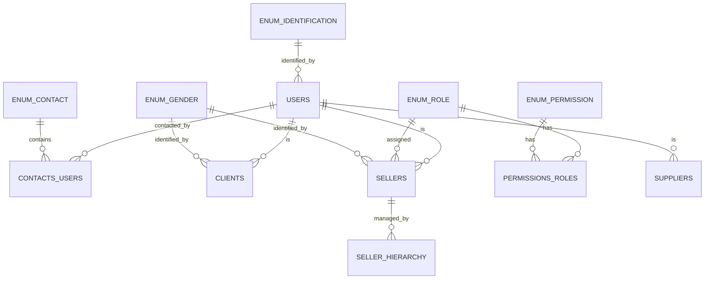

# Sistema POS

## Frontend

```textplain
/
├── login/
└── users/
    ├── clients/
    ├── sellers/
    └── suppliers/
```

## Backend

```textplain
api/
├── POST login/    - Inicia sesión (Vendedor)
├── POST logout/   - Cierra sesión
└── GET  users/    - Lista todos los usuarios
    ├── GET    :id/      - Obtiene la información general del usuario
    ├── GET    :type/    - Lista todos los usuarios de un tipo
    ├── POST   :type/    - Crea un nuevo usuario del tipo mencionado
    ├── PATCH  :id/      - Actualiza la información del usuario
    ├── DELETE :id/      - Elimina a un usuario y todos sus tipos
    └── DELETE :type/:id - Elimina la información de un tipo de usuario

type: clients, sellers, suppliers
```

## Database


