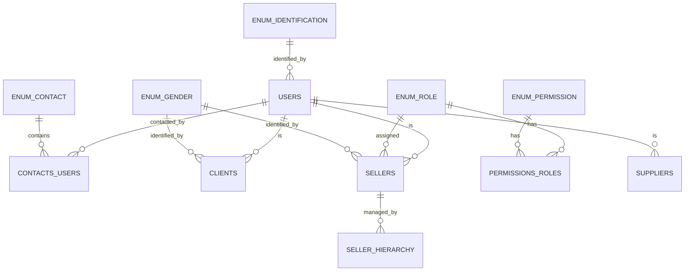

# Sistema POS

## Frontend

```textplain
/
├── login/
└── register/
```

## Backend

```textplain
api/
├── login/
├── logout/
└── register/
```

## Database


```mermaid
erDiagram
    ENUM_CONTACT ||--o{ CONTACTS_USERS : contains
    ENUM_GENDER ||--o{ CLIENTS : identified_by
    ENUM_GENDER ||--o{ SELLERS : identified_by
    ENUM_IDENTIFICATION ||--o{ USERS : identified_by
    ENUM_PERMISSION ||--o{ PERMISSIONS_ROLES : has
    ENUM_ROLE ||--o{ SELLERS : assigned
    ENUM_ROLE ||--o{ PERMISSIONS_ROLES : has

    USERS ||--o{ CLIENTS : is
    USERS ||--o{ SUPPLIERS : is
    USERS ||--o{ SELLERS : is
    USERS ||--o{ CONTACTS_USERS : contacted_by

    SELLERS ||--o{ SELLER_HIERARCHY : managed_by
```
